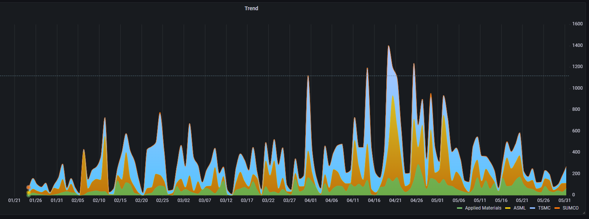
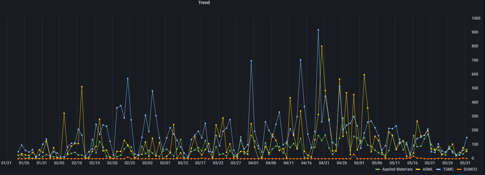
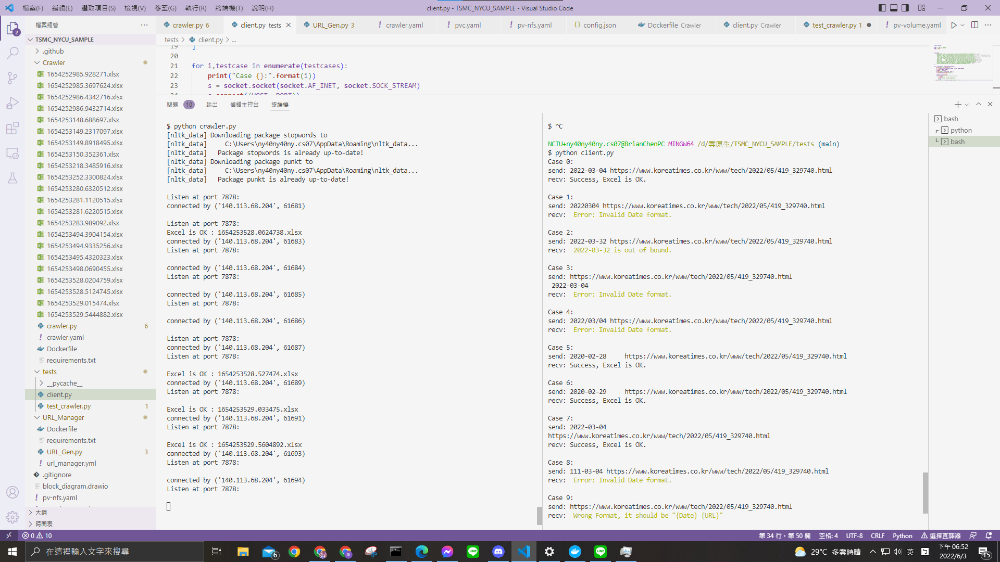
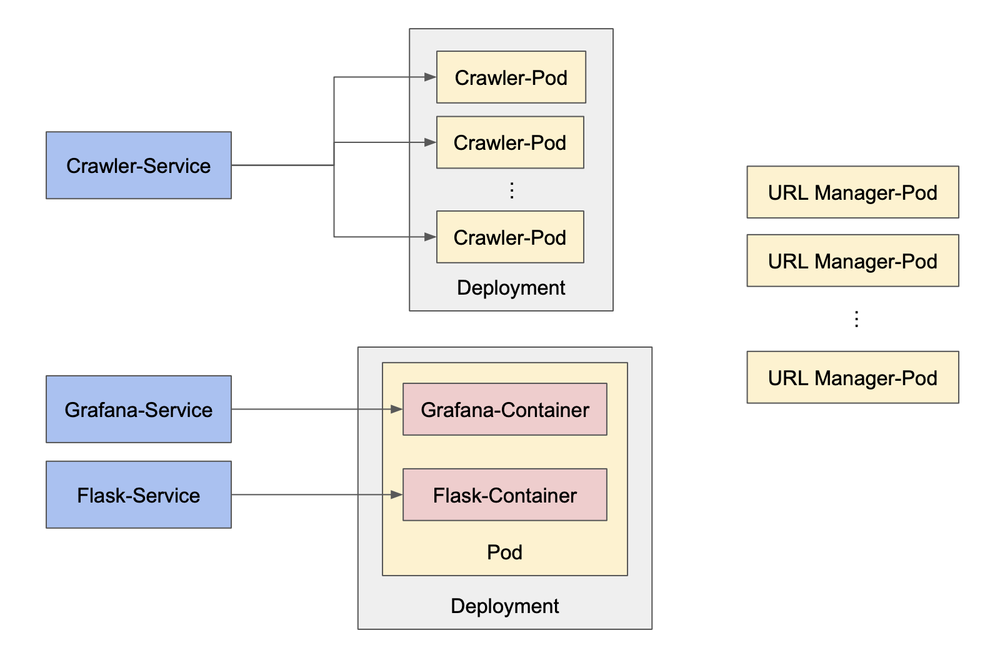
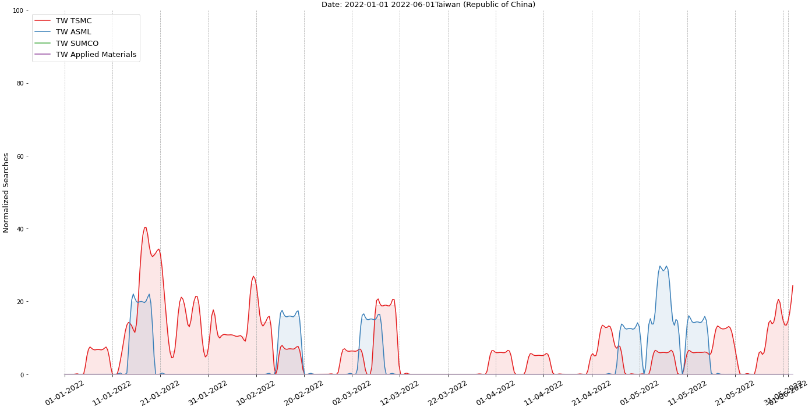
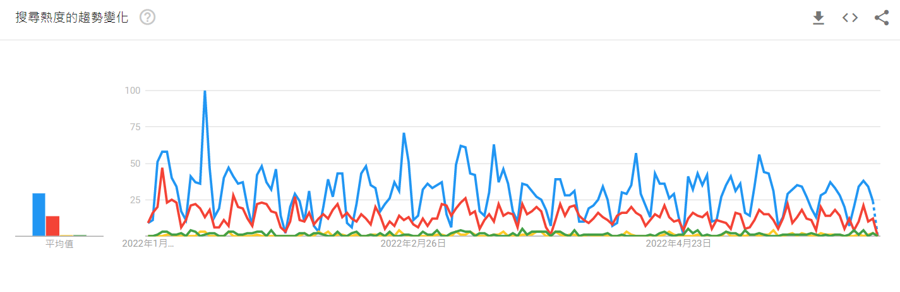

# NYCU 雲原生軟體開發 期末專題

## 第 21 組 -- Digital Business

- 0716016   林思齊
- 0716211   陳煜盛
- 310551135 張宇辰
- 310552017 呂學謹

## 程式架構

### URL manager

- **利用 [schedule](https://schedule.readthedocs.io/en/stable/) 模組自動排定要做 Google 搜尋**
    - 由於 Google 會偵測並阻擋自動化發出的 request，經過各種嘗試後，以 10 分鐘一個 request 去做搜尋，並將工作以日期分工給 32 個 pod
- **利用 Google News 的搜尋並限定時間，找出當日跟搜尋關鍵字有關的新聞連結**
    - 在搜尋的 URL 中加上以下參數: 
        - **tbs** 控制搜尋日期區間 (請見 URL_Manager/URL_Gen.py)
        - **hr** 控制搜尋目標的語言 (lang_en, 英文)
        - **tbm** 設定為新聞搜尋 (nws)
    - 由於新聞搜尋與普通搜尋的介面不同，所以處理 html response 時需要更改找尋的目標
- **以 TCP 的方式去將爬下來的新聞連結傳送至 Crawler**
    - 格式為 {Date:YYYY-MM-DD} {URL}\n

### Crawler (陳煜盛)

- **開啟 TCP socket : Port 7878 等待 URL manager 傳入 URL**
    - 一個 URL 對應到一個 TCP connection，傳完就 close()
    - 用 **threading** 做 **Non-blocking design**，**master thread accept()** 後會交由 **slave thread** 執行 **job()** (以下所有工作)。
- 會先判斷 URL manager 傳過來的字串格式是否正確，若錯誤則回傳錯誤訊息給URL manager，並且不會做以下動作。
- 利用 **requests, [BeautifulSoup](https://github.com/wention/BeautifulSoup4)** 套件搜尋 Google 網頁，並使用 **nltk** 相關套件做字數統計。相關的 function 全部都從 TSMC 的 sample code 中微幅修改。
    - 在 word_count() 新增能將 **Applied Materials** 當成 token 的機制 (連續出現 **"Applied","applied"** 及 **"Materials","materials"**)。
- 將 white_list 裡的 word_count 以 json 的格式用 **POST method** 傳給 **flask_server**。

### Flask server (陳煜盛)

- **Flask framework 為 RESTful API**，可以很方便的用 GET,POST 做傳輸。
- Flask_server 在 /word_count 的路徑底下接受 POST，並將 **json 格式**的 word_count 累加進 **SQlite3 Database**。
    - db 名稱為 **WordCount.db**。
    - Column: 
        - Date : TEXT (format: YYYY-MM-DD)
        - Company : TEXT
        - WordCount : INT
    - 因為不明原因導致 Flask server 在寫入 (INSERT, UPDATE) db 時可能 error，因此我們在 Code 裡面做了 try-except，讓程式碼必然會執行 commit(), close()，以防止 db locked (SQLite busy)。一旦出現這個 error，在 Crawler 的 log 會有 **Status code: 500**，而正常的 Stauts code 會是 **200**。

### Grafana (陳煜盛)

- 在前端的呈現上，使用 Grafana Dashboard 來輸出結果。我們的 data source 是從 5/31 開始往更早以前做 Google search，只要把 Query 寫好，數據就會及時更新在 dashboard 上面。





## Kubernetes & GitHub CI/CD

### CI - Testing

- 測試撰寫的各種 function 是否能正常運行
- 為 crawler 設計 test/client.py，它會傳各種正確或錯誤的"{Date} {URL}\n"，測試 crawler 是否能判斷出格式錯誤。
    ```python3=
    testcases = [
        "2022-03-04 https://www.digitimes.com/tag/tsmc/001264.html\n", # pass
        "20220304 https://www.digitimes.com/tag/tsmc/001264.html\n", # fail : Date wrong format
        "2022-03-32 https://www.digitimes.com/tag/tsmc/001264.html\n", # fail : Date wrong format
        "https://www.digitimes.com/tag/tsmc/001264.html\n 2022-03-04\n", # fail
        "2022/03/04 https://www.digitimes.com/tag/tsmc/001264.html\n", # fail
        "2020-02-28     https://www.digitimes.com/tag/tsmc/001264.html\n", # pass
        "2020-02-29     https://www.digitimes.com/tag/tsmc/001264.html\n", # fail
        "2022-03-04\nhttps://www.digitimes.com/tag/tsmc/001264.html\n", # pass
        "111-03-04 https://www.digitimes.com/tag/tsmc/001264.html\n", # fail
        "https://www.digitimes.com/tag/tsmc/001264.html\n", # fail
        "2022-03-04 flkjw;fkej;welkfje;fkejkej\n"
    ]
    ```
    - 測試結果會長這樣

    

### CD - GKE

在部署至GKE之前，須先在GKE啟動**Autopilot Cluster**、設定IAM權限、取得金鑰，並在GitHub的Repository上設定Project ID與金鑰。

以下為專案在GKE上的架構：

 * **URL Manager**使用多個Pods產生URL；
 * **Crawler**使用Deployment元件產生多個Pods執行爬蟲任務，並使用Service元件與Pods連接；
 * **Grafana**與**Flask**執行在相同Pod上面，個別用Service元件連接，分別負責圖表顯示與資料庫存取。



透過**GitHub Action**，當專案推至分支"**main**"會自動執行以下步驟：
 * 獲得GKE cluster的授權
 * 利用Docker建置Crawler image
 * 利用Docker建置URL Manger image
 * 利用Docker建置Flask Server image
 * 將上述三份image推至GCR
 * 利用Kustomize將**deployment.yml**與**service.yml**部署至GKE

經過一段時間的爬蟲，可利用**Grafana的Service IP**進入Grafana Dashboard觀看關鍵字熱度分布。

## GoogleTrend API 以及 Google Trend網頁結果比較

### GoogleTrend API:




### GoogleTrend瀏覽器:



## 問題與討論